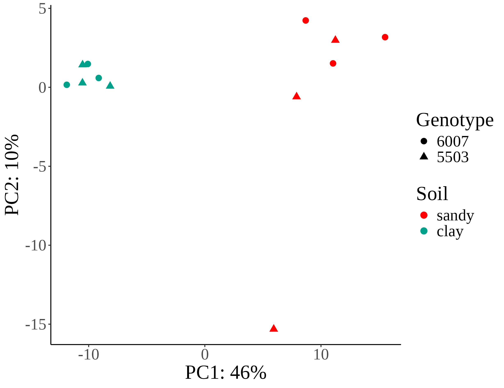
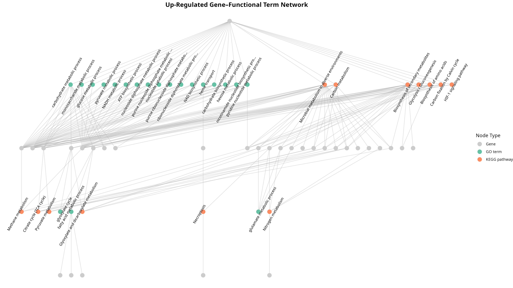
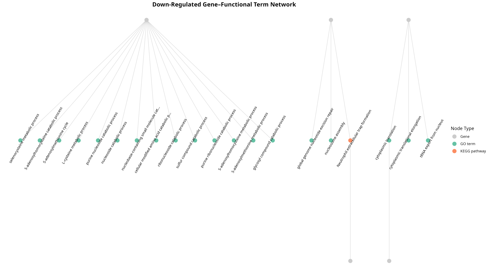

# bookish-waffle

# RNAseq analysis for smut pathogen (*Sporisorium scitamineum*) in sugarcane 

## Overview

ALL FILES IN /home/diegoj/bianca

---

## Repository Structure

```
.
├── raw_reads
├── README.md
├── references
├── rnaseq

```

## RNAseq Workflow Description

| sample                   | fastq_1                                                                                   | fastq_2                                                                                   | strandedness | status    | genotype | soil  | group        |
|--------------------------|--------------------------------------------------------------------------------------------|--------------------------------------------------------------------------------------------|--------------|-----------|----------|-------|--------------|
| 5503_clay_control_1      | /home/diegoj/bianca/raw_reads/NGS726_19_S19_L001_R1_001.fastq.gz                          | /home/diegoj/bianca/raw_reads/NGS726_19_S19_L001_R2_001.fastq.gz                          | auto         | control   | 5503     | clay  | NA           |
| 5503_clay_control_2      | /home/diegoj/bianca/raw_reads/NGS726_20_S20_L001_R1_001.fastq.gz                          | /home/diegoj/bianca/raw_reads/NGS726_20_S20_L001_R2_001.fastq.gz                          | auto         | control   | 5503     | clay  | NA           |
| 5503_clay_control_3      | /home/diegoj/bianca/raw_reads/NGS726_21_S21_L001_R1_001.fastq.gz                          | /home/diegoj/bianca/raw_reads/NGS726_21_S21_L001_R2_001.fastq.gz                          | auto         | control   | 5503     | clay  | NA           |
| 5503_clay_inoc_1         | /home/diegoj/bianca/raw_reads/NGS726_13_S13_L001_R1_001.fastq.gz                          | /home/diegoj/bianca/raw_reads/NGS726_13_S13_L001_R2_001.fastq.gz                          | auto         | infected  | 5503     | clay  | 5503_clay    |
| 5503_clay_inoc_2         | /home/diegoj/bianca/raw_reads/NGS726_14_S14_L001_R1_001.fastq.gz                          | /home/diegoj/bianca/raw_reads/NGS726_14_S14_L001_R2_001.fastq.gz                          | auto         | infected  | 5503     | clay  | 5503_clay    |
| 5503_clay_inoc_3         | /home/diegoj/bianca/raw_reads/NGS726_15_S15_L001_R1_001.fastq.gz                          | /home/diegoj/bianca/raw_reads/NGS726_15_S15_L001_R2_001.fastq.gz                          | auto         | infected  | 5503     | clay  | 5503_clay    |
| 5503_sandy_control_1     | /home/diegoj/bianca/raw_reads/NGS726_7_S7_L001_R1_001.fastq.gz                            | /home/diegoj/bianca/raw_reads/NGS726_7_S7_L001_R2_001.fastq.gz                            | auto         | control   | 5503     | sandy | NA           |
| 5503_sandy_control_2     | /home/diegoj/bianca/raw_reads/NGS726_8_S8_L001_R1_001.fastq.gz                            | /home/diegoj/bianca/raw_reads/NGS726_8_S8_L001_R2_001.fastq.gz                            | auto         | control   | 5503     | sandy | NA           |
| 5503_sandy_control_3     | /home/diegoj/bianca/raw_reads/NGS726_9_S9_L001_R1_001.fastq.gz                            | /home/diegoj/bianca/raw_reads/NGS726_9_S9_L001_R2_001.fastq.gz                            | auto         | control   | 5503     | sandy | NA           |
| 5503_sandy_inoc_1        | /home/diegoj/bianca/raw_reads/NGS726_1_S1_L001_R1_001.fastq.gz                            | /home/diegoj/bianca/raw_reads/NGS726_1_S1_L001_R2_001.fastq.gz                            | auto         | infected  | 5503     | sandy | 5503_sandy   |
| 5503_sandy_inoc_2        | /home/diegoj/bianca/raw_reads/NGS726_2_S2_L001_R1_001.fastq.gz                            | /home/diegoj/bianca/raw_reads/NGS726_2_S2_L001_R2_001.fastq.gz                            | auto         | infected  | 5503     | sandy | 5503_sandy   |
| 5503_sandy_inoc_3        | /home/diegoj/bianca/raw_reads/NGS726_3_S3_L001_R1_001.fastq.gz                            | /home/diegoj/bianca/raw_reads/NGS726_3_S3_L001_R2_001.fastq.gz                            | auto         | infected  | 5503     | sandy | 5503_sandy   |
| 6007_clay_control_1      | /home/diegoj/bianca/raw_reads/NGS726_22_S22_L001_R1_001.fastq.gz                          | /home/diegoj/bianca/raw_reads/NGS726_22_S22_L001_R2_001.fastq.gz                          | auto         | control   | 6007     | clay  | NA           |
| 6007_clay_control_2      | /home/diegoj/bianca/raw_reads/NGS726_23_S23_L001_R1_001.fastq.gz                          | /home/diegoj/bianca/raw_reads/NGS726_23_S23_L001_R2_001.fastq.gz                          | auto         | control   | 6007     | clay  | NA           |
| 6007_clay_control_3      | /home/diegoj/bianca/raw_reads/NGS726_24_S24_L001_R1_001.fastq.gz                          | /home/diegoj/bianca/raw_reads/NGS726_24_S24_L001_R2_001.fastq.gz                          | auto         | control   | 6007     | clay  | NA           |
| 6007_clay_inoc_1         | /home/diegoj/bianca/raw_reads/NGS726_16_S16_L001_R1_001.fastq.gz                          | /home/diegoj/bianca/raw_reads/NGS726_16_S16_L001_R2_001.fastq.gz                          | auto         | infected  | 6007     | clay  | 6007_clay    |
| 6007_clay_inoc_2         | /home/diegoj/bianca/raw_reads/NGS726_17_S17_L001_R1_001.fastq.gz                          | /home/diegoj/bianca/raw_reads/NGS726_17_S17_L001_R2_001.fastq.gz                          | auto         | infected  | 6007     | clay  | 6007_clay    |
| 6007_clay_inoc_3         | /home/diegoj/bianca/raw_reads/NGS726_18_S18_L001_R1_001.fastq.gz                          | /home/diegoj/bianca/raw_reads/NGS726_18_S18_L001_R2_001.fastq.gz                          | auto         | infected  | 6007     | clay  | 6007_clay    |
| 6007_sandy_control_1     | /home/diegoj/bianca/raw_reads/NGS726_10_S10_L001_R1_001.fastq.gz                          | /home/diegoj/bianca/raw_reads/NGS726_10_S10_L001_R2_001.fastq.gz                          | auto         | control   | 6007     | sandy | NA           |
| 6007_sandy_control_2     | /home/diegoj/bianca/raw_reads/NGS726_11_S11_L001_R1_001.fastq.gz                          | /home/diegoj/bianca/raw_reads/NGS726_11_S11_L001_R2_001.fastq.gz                          | auto         | control   | 6007     | sandy | NA           |
| 6007_sandy_control_3     | /home/diegoj/bianca/raw_reads/NGS726_12_S12_L001_R1_001.fastq.gz                          | /home/diegoj/bianca/raw_reads/NGS726_12_S12_L001_R2_001.fastq.gz                          | auto         | control   | 6007     | sandy | NA           |
| 6007_sandy_inoc_1        | /home/diegoj/bianca/raw_reads/NGS726_4_S4_L001_R1_001.fastq.gz                            | /home/diegoj/bianca/raw_reads/NGS726_4_S4_L001_R2_001.fastq.gz                            | auto         | infected  | 6007     | sandy | 6007_sandy   |
| 6007_sandy_inoc_2        | /home/diegoj/bianca/raw_reads/NGS726_5_S5_L001_R1_001.fastq.gz                            | /home/diegoj/bianca/raw_reads/NGS726_5_S5_L001_R2_001.fastq.gz                            | auto         | infected  | 6007     | sandy | 6007_sandy   |
| 6007_sandy_inoc_3        | /home/diegoj/bianca/raw_reads/NGS726_6_S6_L001_R1_001.fastq.gz                            | /home/diegoj/bianca/raw_reads/NGS726_6_S6_L001_R2_001.fastq.gz                            | auto         | infected  | 6007     | sandy | 6007_sandy   |


### 1. **References**

- `Genome Assembly`: /home/diegoj/bianca/references/PEDRO_genome/fix_pedro.fasta 
- `Proteins`: /home/diegoj/bianca/references/PEDRO_genome/proteins_clean.fasta
- `GTF`: /home/diegoj/bianca/references/PEDRO_genome/SSC04-MAT1.gtf

### 2. **Protein Annotation**

We used `emapper-2.1.3` from `EggNOG v5.0` to get KEGG orthology and GO  annotations for the proteins of the genome based on orthology relationships. 
- Results: `/home/diegoj/bianca/references/PEDRO_genome/annotation/eggnog.emapper.annotations`

### 3. **RNAseq processing**

We used a `Nextflow v25.04.7` pipeline `rnaseq (v3.12.0)` from nf-core (https://nf-co.re/rnaseq/3.12.0) to preprocces, align and quantify RNAseq data

We used the default method from `rnaseq (v3.12.0)` which uses `STAR` aligner and `Salmon` to quantify transcript abundance.

Full report of preprocess and aligment can be found in 
[Download full report (html)]( rnaseq/full_run1_no_collapse/multiqc/star_salmon/multiqc_report.html)*(right-click and save as to view)*


### 4. **Exploratory Analysis**

- Principal component analysis: We load the quantification data produced by Salmon into DESEQ2 (Love et al., 2014) and used the transformed counts matrix variance stabilizing transformation (vst) which accounts for the dependance between abundance and variance in RNAseq data.




### 5. **Differential Expression Analysis (DEA)**

We conducted a differential expression analysis (DEA) using DESEeq2 R package between several contrasts: 5503 clay vs 5503 sandy (4, 5, 6 vs 10, 11, 12), 6007 clay vs 6007 sandy (16, 17, 18 vs 22, 23, 24),  5503 clay vs 6007 clay (4, 5, 6 vs 16, 17, 18), 5503 sandy vs 6007 sandy (10, 11, 12 vs 22, 23, 24)

We used `lfcThreshold = 1` and `altHypothesis = "greaterAbs"` to identify transcripts that were differentially expressed at least twofold above or below the background expression level. We refer to upregulated genes as those more highly expressed in the control condition than in the infected, and downregulated genes as those more highly expressed in the infected than in the control condition.

| Contrast              | Total | Upregulated | Downregulated |
|-----------------------|-------|-------------|---------------|
| 5503_clay_vs_sandy    | 1     | 0           | 1             |
| 6007_clay_vs_sandy    | 1     | 1           | 0             |
| 5503_vs_6007_clay     | 0     | 0           | 0             |
| 5503_vs_6007_sandy    | 0     | 0           | 0             |
| overall_clay_vs_sandy | 88    | 83          | 5             |
| overall_5503_vs_6007  | 0     | 0           | 0             |


- code: /home/diegoj/bianca/rnaseq/full_run1_no_collapse/star_salmon/deseq2_qc/dea_claude_dev.r
- results: /home/diegoj/bianca/rnaseq/full_run1_no_collapse/star_salmon/deseq2_qc/

### 6. **Functional Enrichment Analysis**

To get insights about the function and the processes that are represented by the sets of up-regulated and down-regulated genes we carried out over representation analysis (ORA) for gene ontology terms (GO) and KEGG pathways.

- GO: We used topGO R package (v2.58.0), p-value < 0.05 and corrected for multiple testing using BH procedure

    - Up: [View overrepresented GO terms in up-regulated genes (PDF)](rnaseq/full_run1_no_collapse/star_salmon/deseq2_qc/overall_clay_vs_sandy/GO_up.pdf)

    - Down: [View overrepresented GO terms in down-regulated genes (PDF)](rnaseq/full_run1_no_collapse/star_salmon/deseq2_qc/overall_clay_vs_sandy/GO_down.pdf)

- KEGG: We used enrichKEGG function from Cluster profiler R package (v4.14.6) to get KEGG enriched categories in each gene set

[Overrepresented KEGGs in differentially expressed genes (PDF)](rnaseq/full_run1_no_collapse/star_salmon/deseq2_qc/overall_clay_vs_sandy/keggs_plots.pdf)


### 7. **Putative effector annotation**

We used Phobius v1.01 (https://phobius.sbc.su.se/) to signal peptides and transmembrane domais, the proteins with at least one signal peptide and with no transmembrando domains where classified as putative effectors.

references/PEDRO_genome/annotation/putative_effectors.txt


### 8. **GO-KEGG Interaction Network**

- Up: 

- Down: 

### 9. **Important Files**

| **Process Step** | **Description** | **File Path** |
|------------------|-----------------|----------------|
| **Quality Control** | MultiQC report | `rnaseq/full_run1_no_collapse/multiqc/star_salmon/multiqc_report.html` |
| **Quantification (Salmon)** | TPM counts | `rnaseq/full_run1_no_collapse//star_salmon/salmon.merged.gene_counts.tsv` |
| | RAW counts | `rnaseq/full_run1_no_collapse/star_salmon/salmon.merged.transcript_counts.tsv` |
| **Differential Expression (DESeq2)** | Up-regulated genes | `rnaseq/full_run1_no_collapse/star_salmon/deseq2_qc/overall_clay_vs_sandy/DEGs_upregulated_overall_clay_vs_sandy.csv` |
| | Down-regulated genes | `rnaseq/full_run1_no_collapse/star_salmon/deseq2_qc/overall_clay_vs_sandy/DEGs_upregulated_overall_clay_vs_sandy.csv` |
| | Main dir analysis | `rnaseq/full_run1_no_collapse/star_salmon/deseq2_qc/` |
| **Functional Enrichment (GO & KEGG)** | GO up results | `rnaseq/full_run1_no_collapse/star_salmon/deseq2_qc/overall_clay_vs_sandy/GO_up.csv` |
| | GO down results | `rnaseq/full_run1_no_collapse/star_salmon/deseq2_qc/overall_clay_vs_sandy/GO_down.csv` |
| | GO–KEGG interaction network (up-regulated) | `rnaseq/full_run1_no_collapse/star_salmon/deseq2_qc/overall_clay_vs_sandy/gene_network_up_edges.tsv` |
| | GO–KEGG interaction network (down-regulated) | `rnaseq/full_run1_no_collapse/star_salmon/deseq2_qc/overall_clay_vs_sandy/gene_network_down_edges.tsv` |
| **Functional Annotation** | EggNOG results | `references/PEDRO_genome/annotation/eggnog.emapper.annotations` |

