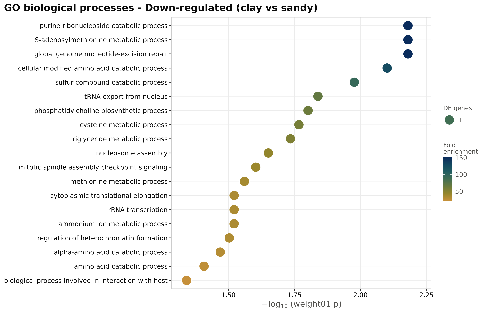

# bookish-waffle

# RNAseq analysis for smut pathogen (*Sporisorium scitamineum*) in sugarcane 

## Overview

ALL FILES IN /dados04/jorge/bianca

---

## Repository Structure

```
.
├── raw_reads
├── README.md
├── references
├── rnaseq

```

## RNAseq Workflow Description

| sample                   | fastq_1                                                                                   | fastq_2                                                                                   | strandedness | status    | genotype | soil  | group        |
|--------------------------|--------------------------------------------------------------------------------------------|--------------------------------------------------------------------------------------------|--------------|-----------|----------|-------|--------------|
| 5503_clay_control_1      | /dados04/jorge/bianca/raw_reads/NGS726_19_S19_L001_R1_001.fastq.gz                          | /dados04/jorge/bianca/raw_reads/NGS726_19_S19_L001_R2_001.fastq.gz                          | auto         | control   | 5503     | clay  | NA           |
| 5503_clay_control_2      | /dados04/jorge/bianca/raw_reads/NGS726_20_S20_L001_R1_001.fastq.gz                          | /dados04/jorge/bianca/raw_reads/NGS726_20_S20_L001_R2_001.fastq.gz                          | auto         | control   | 5503     | clay  | NA           |
| 5503_clay_control_3      | /dados04/jorge/bianca/raw_reads/NGS726_21_S21_L001_R1_001.fastq.gz                          | /dados04/jorge/bianca/raw_reads/NGS726_21_S21_L001_R2_001.fastq.gz                          | auto         | control   | 5503     | clay  | NA           |
| 5503_clay_inoc_1         | /dados04/jorge/bianca/raw_reads/NGS726_13_S13_L001_R1_001.fastq.gz                          | /dados04/jorge/bianca/raw_reads/NGS726_13_S13_L001_R2_001.fastq.gz                          | auto         | infected  | 5503     | clay  | 5503_clay    |
| 5503_clay_inoc_2         | /dados04/jorge/bianca/raw_reads/NGS726_14_S14_L001_R1_001.fastq.gz                          | /dados04/jorge/bianca/raw_reads/NGS726_14_S14_L001_R2_001.fastq.gz                          | auto         | infected  | 5503     | clay  | 5503_clay    |
| 5503_clay_inoc_3         | /dados04/jorge/bianca/raw_reads/NGS726_15_S15_L001_R1_001.fastq.gz                          | /dados04/jorge/bianca/raw_reads/NGS726_15_S15_L001_R2_001.fastq.gz                          | auto         | infected  | 5503     | clay  | 5503_clay    |
| 5503_sandy_control_1     | /dados04/jorge/bianca/raw_reads/NGS726_7_S7_L001_R1_001.fastq.gz                            | /dados04/jorge/bianca/raw_reads/NGS726_7_S7_L001_R2_001.fastq.gz                            | auto         | control   | 5503     | sandy | NA           |
| 5503_sandy_control_2     | /dados04/jorge/bianca/raw_reads/NGS726_8_S8_L001_R1_001.fastq.gz                            | /dados04/jorge/bianca/raw_reads/NGS726_8_S8_L001_R2_001.fastq.gz                            | auto         | control   | 5503     | sandy | NA           |
| 5503_sandy_control_3     | /dados04/jorge/bianca/raw_reads/NGS726_9_S9_L001_R1_001.fastq.gz                            | /dados04/jorge/bianca/raw_reads/NGS726_9_S9_L001_R2_001.fastq.gz                            | auto         | control   | 5503     | sandy | NA           |
| 5503_sandy_inoc_1        | /dados04/jorge/bianca/raw_reads/NGS726_1_S1_L001_R1_001.fastq.gz                            | /dados04/jorge/bianca/raw_reads/NGS726_1_S1_L001_R2_001.fastq.gz                            | auto         | infected  | 5503     | sandy | 5503_sandy   |
| 5503_sandy_inoc_2        | /dados04/jorge/bianca/raw_reads/NGS726_2_S2_L001_R1_001.fastq.gz                            | /dados04/jorge/bianca/raw_reads/NGS726_2_S2_L001_R2_001.fastq.gz                            | auto         | infected  | 5503     | sandy | 5503_sandy   |
| 5503_sandy_inoc_3        | /dados04/jorge/bianca/raw_reads/NGS726_3_S3_L001_R1_001.fastq.gz                            | /dados04/jorge/bianca/raw_reads/NGS726_3_S3_L001_R2_001.fastq.gz                            | auto         | infected  | 5503     | sandy | 5503_sandy   |
| 6007_clay_control_1      | /dados04/jorge/bianca/raw_reads/NGS726_22_S22_L001_R1_001.fastq.gz                          | /dados04/jorge/bianca/raw_reads/NGS726_22_S22_L001_R2_001.fastq.gz                          | auto         | control   | 6007     | clay  | NA           |
| 6007_clay_control_2      | /dados04/jorge/bianca/raw_reads/NGS726_23_S23_L001_R1_001.fastq.gz                          | /dados04/jorge/bianca/raw_reads/NGS726_23_S23_L001_R2_001.fastq.gz                          | auto         | control   | 6007     | clay  | NA           |
| 6007_clay_control_3      | /dados04/jorge/bianca/raw_reads/NGS726_24_S24_L001_R1_001.fastq.gz                          | /dados04/jorge/bianca/raw_reads/NGS726_24_S24_L001_R2_001.fastq.gz                          | auto         | control   | 6007     | clay  | NA           |
| 6007_clay_inoc_1         | /dados04/jorge/bianca/raw_reads/NGS726_16_S16_L001_R1_001.fastq.gz                          | /dados04/jorge/bianca/raw_reads/NGS726_16_S16_L001_R2_001.fastq.gz                          | auto         | infected  | 6007     | clay  | 6007_clay    |
| 6007_clay_inoc_2         | /dados04/jorge/bianca/raw_reads/NGS726_17_S17_L001_R1_001.fastq.gz                          | /dados04/jorge/bianca/raw_reads/NGS726_17_S17_L001_R2_001.fastq.gz                          | auto         | infected  | 6007     | clay  | 6007_clay    |
| 6007_clay_inoc_3         | /dados04/jorge/bianca/raw_reads/NGS726_18_S18_L001_R1_001.fastq.gz                          | /dados04/jorge/bianca/raw_reads/NGS726_18_S18_L001_R2_001.fastq.gz                          | auto         | infected  | 6007     | clay  | 6007_clay    |
| 6007_sandy_control_1     | /dados04/jorge/bianca/raw_reads/NGS726_10_S10_L001_R1_001.fastq.gz                          | /dados04/jorge/bianca/raw_reads/NGS726_10_S10_L001_R2_001.fastq.gz                          | auto         | control   | 6007     | sandy | NA           |
| 6007_sandy_control_2     | /dados04/jorge/bianca/raw_reads/NGS726_11_S11_L001_R1_001.fastq.gz                          | /dados04/jorge/bianca/raw_reads/NGS726_11_S11_L001_R2_001.fastq.gz                          | auto         | control   | 6007     | sandy | NA           |
| 6007_sandy_control_3     | /dados04/jorge/bianca/raw_reads/NGS726_12_S12_L001_R1_001.fastq.gz                          | /dados04/jorge/bianca/raw_reads/NGS726_12_S12_L001_R2_001.fastq.gz                          | auto         | control   | 6007     | sandy | NA           |
| 6007_sandy_inoc_1        | /dados04/jorge/bianca/raw_reads/NGS726_4_S4_L001_R1_001.fastq.gz                            | /dados04/jorge/bianca/raw_reads/NGS726_4_S4_L001_R2_001.fastq.gz                            | auto         | infected  | 6007     | sandy | 6007_sandy   |
| 6007_sandy_inoc_2        | /dados04/jorge/bianca/raw_reads/NGS726_5_S5_L001_R1_001.fastq.gz                            | /dados04/jorge/bianca/raw_reads/NGS726_5_S5_L001_R2_001.fastq.gz                            | auto         | infected  | 6007     | sandy | 6007_sandy   |
| 6007_sandy_inoc_3        | /dados04/jorge/bianca/raw_reads/NGS726_6_S6_L001_R1_001.fastq.gz                            | /dados04/jorge/bianca/raw_reads/NGS726_6_S6_L001_R2_001.fastq.gz                            | auto         | infected  | 6007     | sandy | 6007_sandy   |


### 1. **References**

- `Genome Assembly`: /dados04/jorge/bianca/references/PEDRO_genome/fix_pedro.fasta 
- `Proteins`: /dados04/jorge/bianca/references/PEDRO_genome/proteins_clean.fasta
- `GTF`: /dados04/jorge/bianca/references/PEDRO_genome/SSC04-MAT1.gtf

### 2. **Protein Annotation**

We used `emapper-2.1.3` from `EggNOG v5.0` to get KEGG orthology and GO  annotations for the proteins of the genome based on orthology relationships. 
- Results: `/dados04/jorge/bianca/references/PEDRO_genome/annotation/eggnog.emapper.annotations`

### 3. **RNAseq processing**

We used a `Nextflow v25.04.7` pipeline `rnaseq (v3.12.0)` from nf-core (https://nf-co.re/rnaseq/3.12.0) to preprocces, align and quantify RNAseq data

We used the default method from `rnaseq (v3.12.0)` which uses `STAR` aligner and `Salmon` to quantify transcript abundance.

See full software versions in 

[Sofware versions (txt)](rnaseq/full_run1_no_collapse/pipeline_info/nf_core_rnaseq_software_mqc_versions.yml)


Full report of preprocess and aligment can be found in 
[Download full MultiQC report (html)](rnaseq/full_run1_no_collapse/multiqc/star_salmon/multiqc_report.html) *(right-click and save as to view)*


### 4. **Exploratory Analysis**

- Principal component analysis: We load the quantification data produced by Salmon into DESEQ2 (Love et al., 2014) and used the transformed counts matrix variance stabilizing transformation (vst) which accounts for the dependance between abundance and variance in RNAseq data.


### 5. **Differential Expression Analysis (DEA)**

We conducted a differential expression analysis (DEA) using DESEeq2 R package between several contrasts: 5503 clay vs 5503 sandy (4, 5, 6 vs 10, 11, 12), 6007 clay vs 6007 sandy (16, 17, 18 vs 22, 23, 24),  5503 clay vs 6007 clay (4, 5, 6 vs 16, 17, 18), 5503 sandy vs 6007 sandy (10, 11, 12 vs 22, 23, 24). We filtered out low expressed genes with less than 1 count in at least 7/12 samples (or 4/6 depending o the tested contrasts).

We used `lfcThreshold = 1` and `altHypothesis = "greaterAbs"` to identify transcripts that were differentially expressed at least twofold above or below the background expression level. We refer to upregulated genes as those more highly expressed in clay than in sand, downregulated genes as those more highly expressed in the sand than in the clay soil. We corrected multiple testing using FDR (false discovery rate);

| Contrast              | Total | Upregulated | Downregulated |
|-----------------------|-------|-------------|---------------|
| 5503_clay_vs_sandy    | 1     | 0           | 1             |
| 6007_clay_vs_sandy    | 1     | 1           | 0             |
| 5503_vs_6007_clay     | 0     | 0           | 0             |
| 5503_vs_6007_sandy    | 0     | 0           | 0             |
| overall_clay_vs_sandy | 88    | 83          | 5             |
| overall_5503_vs_6007  | 0     | 0           | 0             |


- code: /dados04/jorge/bianca/rnaseq/full_run1_no_collapse/star_salmon/deseq2_qc/dea_claude_dev.r

    For overrall clay vs sand the complete results are located at 
- results: /dados04/jorge/bianca/rnaseq/full_run1_no_collapse/star_salmon/deseq2_qc/overall_clay_vs_sandy/

### 6. **Functional Enrichment Analysis**

To get insights about the function and the processes that are represented by the sets of up-regulated and down-regulated genes we carried out over representation analysis (ORA) for gene ontology terms (GO) and KEGG pathways.

#### GO enrichment — topGO `weight01`

We used the topGO R package (v2.58.0) restricted to the **Biological Process** ontology. The gene universe is the **3,024 genes carrying at least one BP annotation** in the reference annotation, and terms with fewer than five annotated genes were excluded (`nodeSize = 5`), leaving **2,633 testable terms**.

**The method reported here is `weight01`, which is topology-aware:** it traverses the GO graph from the most specific terms upward and scores each term *conditional on its descendants*, so a broad parent term whose signal is already explained by a more specific child is down-weighted. This removes the redundant ancestor/descendant blocks that a term-by-term test produces (102 of the 137 terms nominally significant under `classic` fall to p = 1 under `weight01`).

**`weight01` p-values are reported uncorrected, and this is deliberate.** The algorithm conditions each term's test on its descendants, so the tests are non-independent by construction and a correction that assumes independence is ill-defined; the method's authors state that `weight01` scores should not be interpreted as p-values in the classical sense. We use raw `weight01` p < 0.05 as the reporting criterion.

Note what this does and does not buy us: skipping the correction is a statement about the tests being dependent, **not** a guarantee of error-rate control. `weight01` ranks terms; it does not certify them. Whether a ranked term means anything therefore depends on how many genes support it, which is the deciding factor below.

The counts below are the row counts of the two result tables, one per gene set:

| gene set | terms at `weight01` p < 0.05 | genes per term | verdict | source table |
|---|---|---|---|---|
| up-regulated in clay (83 genes) | **28** | 2–8 | interpretable; central carbon metabolism | [`GO_up_weight01_p0.05.csv`](rnaseq/full_run1_no_collapse/star_salmon/deseq2_qc/overall_clay_vs_sandy/topgo_corrected/GO_up_weight01_p0.05.csv) |
| down-regulated in clay (5 genes) | 19 | **1 for every term** | not interpretable — see below | [`GO_down_weight01_p0.05.csv`](rnaseq/full_run1_no_collapse/star_salmon/deseq2_qc/overall_clay_vs_sandy/topgo_corrected/GO_down_weight01_p0.05.csv) |

Both tables carry, per term: `GO.ID`, `Term`, `Annotated` (genes in the universe annotated to the term), `Significant` (DE genes among them — the quantity plotted as point area), `Expected`, `FoldEnrichment` (plotted as fill colour), `p_classic`, `fdr_classic_BH` and `p_weight01` (plotted on the x axis). The unfiltered equivalents covering all 2,633 tested terms are [`GO_up_all_tested_terms.csv`](rnaseq/full_run1_no_collapse/star_salmon/deseq2_qc/overall_clay_vs_sandy/topgo_corrected/GO_up_all_tested_terms.csv) and [`GO_down_all_tested_terms.csv`](rnaseq/full_run1_no_collapse/star_salmon/deseq2_qc/overall_clay_vs_sandy/topgo_corrected/GO_down_all_tested_terms.csv).

**Up-regulated (main result)** — the figure below plots the 20 most significant of the 28 terms in [`GO_up_weight01_p0.05.csv`](rnaseq/full_run1_no_collapse/star_salmon/deseq2_qc/overall_clay_vs_sandy/topgo_corrected/GO_up_weight01_p0.05.csv), ordered by increasing `p_weight01`. Point area = `Significant`, the number of up-regulated genes annotated to the term (2–8); fill colour = `FoldEnrichment` over the count expected by chance (7.3–44.8×); dashed line = p = 0.05.


[Up-regulated, weight01 (PDF)](rnaseq/full_run1_no_collapse/star_salmon/deseq2_qc/overall_clay_vs_sandy/topgo_corrected/GO_up_weight01.pdf) — plotted from [`GO_up_weight01_p0.05.csv`](rnaseq/full_run1_no_collapse/star_salmon/deseq2_qc/overall_clay_vs_sandy/topgo_corrected/GO_up_weight01_p0.05.csv)

**Down-regulated — 19 terms pass the criterion, and none of them is interpretable.** This is not a multiple-testing verdict, so it needs stating carefully. Under our reporting criterion (`weight01` p < 0.05) this gene set returns 19 terms; they are discarded on the evidence behind them, not on a corrected threshold.

The down-regulated set contains only 5 genes, 4 of which carry a GO annotation, and **every one of the 19 terms is supported by exactly one gene** — the `Significant` column of [`GO_down_weight01_p0.05.csv`](rnaseq/full_run1_no_collapse/star_salmon/deseq2_qc/overall_clay_vs_sandy/topgo_corrected/GO_down_weight01_p0.05.csv) reads `1` in every row. A single gene falling in a small term is enough to produce p ≈ 0.007 from Fisher's exact test, and the resulting 21.6–151.2× fold enrichments are arithmetic on counts of one, not biological enrichment.


The figure below plots all 19 terms of [`GO_down_weight01_p0.05.csv`](rnaseq/full_run1_no_collapse/star_salmon/deseq2_qc/overall_clay_vs_sandy/topgo_corrected/GO_down_weight01_p0.05.csv), with the same encodings as the up-regulated panel; every point carries the smallest size in the legend, which is the one-gene support made visible.




[Down-regulated, weight01 — (PDF)](rnaseq/full_run1_no_collapse/star_salmon/deseq2_qc/overall_clay_vs_sandy/topgo_corrected/GO_down_weight01.pdf) — plotted from [`GO_down_weight01_p0.05.csv`](rnaseq/full_run1_no_collapse/star_salmon/deseq2_qc/overall_clay_vs_sandy/topgo_corrected/GO_down_weight01_p0.05.csv)


- Alexa A, Rahnenführer J, Lengauer T (2006) Improved scoring of functional groups from gene expression data by decorrelating GO graph structure. *Bioinformatics* 22:1600–1607.
- Crameri F (2018) Scientific colour maps. Zenodo, doi:10.5281/zenodo.1243862.

#### KEGG

We used the enrichKEGG function from Cluster profiler R package (v4.14.6) to get KEGG enriched categories in each gene set (up regulated and down regulated)

[Overrepresented KEGGs in differentially expressed genes (PDF)](rnaseq/full_run1_no_collapse/star_salmon/deseq2_qc/overall_clay_vs_sandy/keggs_plots.pdf)


### 7. **Putative effector annotation**

We used Phobius v1.01 (https://phobius.sbc.su.se/) to signal peptides and transmembrane domais, the proteins with at least one signal peptide and with no transmembrando domains where classified as putative effectors.

/dados04/jorge/bianca/references/PEDRO_genome/annotation

This classified 687 of the 6,659 annotated genes as putative effectors.

#### Putative effectors among the differentially expressed genes

Crossing the putative effector set with the DEGs of the main contrast
(`overall_clay_vs_sandy`) identifies **10 putative effectors, all of them
up-regulated in clay**; none of the down-regulated genes is a putative effector.
Each of the 10 carries a Phobius signal peptide with a predicted cleavage site
and no transmembrane domain.

| gene | log2FC | padj | baseMean | length (aa) | Cys (%) | EggNOG description |
|---|---|---|---|---|---|---|
| g5898 | 2.70 | 0.034 | 1.4 | 1039 | 1.1 | 2-oxoglutarate dehydrogenase N-terminus |
| g23 | 2.62 | 0.040 | 1.4 | 575 | 2.1 | Amidase |
| g2129 | 2.61 | 0.0087 | 4.1 | 291 | 3.4 | carbohydrate-binding module family 13 protein |
| g3141 | 2.61 | 0.040 | 1.3 | 1494 | 0.8 | pyruvate flavodoxin/ferredoxin oxidoreductase |
| **g3614** | **2.45** | **0.045** | **2.5** | **255** | **11.0** | **no hit** |
| g3201 | 2.40 | 0.0029 | 6.7 | 682 | 0.4 | Fasciclin I domain |
| g2120 | 2.38 | 0.029 | 3.1 | 224 | 0.9 | no hit |
| g1928 | 2.30 | 0.044 | 2.2 | 359 | 2.8 | Transglycosylase SLT domain |
| g2995 | 1.91 | 2.3e-05 | 29.1 | 791 | 0.0 | no hit |
| g5411 | 1.32 | 0.0022 | 18.2 | 560 | 1.6 | no hit |

Source table: [`putative_effectors_in_DEGs.csv`](rnaseq/full_run1_no_collapse/star_salmon/deseq2_qc/overall_clay_vs_sandy/putative_effectors_in_DEGs.csv)
— the 10 genes with their full DESeq2 statistics, per-condition base means, Phobius
signal-peptide predictions, protein length, cysteine content, and EggNOG annotation.

**`g3614` is the strongest candidate.** Canonical fungal effectors are small,
secreted, cysteine-rich proteins with no recognisable homology outside the
species, and `g3614` is the only gene in this set that matches that description on
every count. It is 255 aa against a genome-wide median of 515, and its cysteine
content of 11.0% is more than ten times the median of 0.9% for both the genome as
a whole and the 687 putative effectors — the single most cysteine-rich protein
among the differentially expressed genes. It returns no EggNOG hit at any orthologous
level, so it is not a conserved housekeeping enzyme that happens to be secreted.


### 8. **GO-KEGG Interaction Network**

To get some insights about the function of down regulated and up regulated genes we built two networks, one for up and another for down regulated genes, where the nodes can be represented by genes, GO or KEGG. The edges represent the GO term and/or the KEGG pathways related to that gene. In this way we can explore the functions and the procesess in which the down and up regulated genes are involved.

- Up: 

- Down: 


Full results in: 

/dados04/jorge/bianca/rnaseq/full_run1_no_collapse/star_salmon/deseq2_qc/overall_clay_vs_sandy

### 9. **Important Files**

| **Process Step** | **Description** | **File Path** |
|------------------|-----------------|----------------|
| **Quality Control** | MultiQC report | `rnaseq/full_run1_no_collapse/multiqc/star_salmon/multiqc_report.html` |
| **Quantification (Salmon)** | TPM counts | `rnaseq/full_run1_no_collapse//star_salmon/salmon.merged.gene_counts.tsv` |
| | RAW counts | `rnaseq/full_run1_no_collapse/star_salmon/salmon.merged.transcript_counts.tsv` |
| **Differential Expression (DESeq2)** | Up-regulated genes | `rnaseq/full_run1_no_collapse/star_salmon/deseq2_qc/overall_clay_vs_sandy/DEGs_upregulated_overall_clay_vs_sandy.csv` |
| | Down-regulated genes | `rnaseq/full_run1_no_collapse/star_salmon/deseq2_qc/overall_clay_vs_sandy/DEGs_upregulated_overall_clay_vs_sandy.csv` |
| | Main dir analysis | `rnaseq/full_run1_no_collapse/star_salmon/deseq2_qc/` |
| **Functional Enrichment (GO, topGO `weight01`)** | GO up — significant terms (28) | `rnaseq/full_run1_no_collapse/star_salmon/deseq2_qc/overall_clay_vs_sandy/topgo_corrected/GO_up_weight01_p0.05.csv` |
| | GO down — 19 terms pass p < 0.05, all supported by 1 gene, none interpretable | `rnaseq/full_run1_no_collapse/star_salmon/deseq2_qc/overall_clay_vs_sandy/topgo_corrected/GO_down_weight01_p0.05.csv` |
| | All 2,633 tested terms (counts, fold enrichment, classic p, BH, weight01 p) | `rnaseq/.../overall_clay_vs_sandy/topgo_corrected/GO_{up,down}_all_tested_terms.csv` |
| | Supporting: classic + BH, FDR < 0.05 (67 up, 0 down) | `rnaseq/.../overall_clay_vs_sandy/topgo_corrected/GO_{up,down}_FDR0.05.csv` |
| | Enrichment script | `rnaseq/full_run1_no_collapse/star_salmon/deseq2_qc/topGO_fixed.r` |
| | *Superseded* GO results (kept for comparison) | `rnaseq/full_run1_no_collapse/star_salmon/deseq2_qc/overall_clay_vs_sandy/GO_{up,down}.csv` |
| | GO–KEGG interaction network (up-regulated) | `rnaseq/full_run1_no_collapse/star_salmon/deseq2_qc/overall_clay_vs_sandy/gene_network_up_edges.tsv` |
| | GO–KEGG interaction network (down-regulated) | `rnaseq/full_run1_no_collapse/star_salmon/deseq2_qc/overall_clay_vs_sandy/gene_network_down_edges.tsv` |
| **Functional Annotation** | EggNOG results | `references/PEDRO_genome/annotation/eggnog.emapper.annotations` |
| gene_go_table.txt | formatted GO terms | `references/PEDRO_genome/annotation/gene_go_table.txt` |
| putative_effectors.ids | Putative effectors | `references/PEDRO_genome/annotation/putative_effectors.ids` |
| | Putative effectors among the DEGs (10 genes, with DESeq2 stats, Phobius and EggNOG annotation) | `rnaseq/full_run1_no_collapse/star_salmon/deseq2_qc/overall_clay_vs_sandy/putative_effectors_in_DEGs.csv` |


