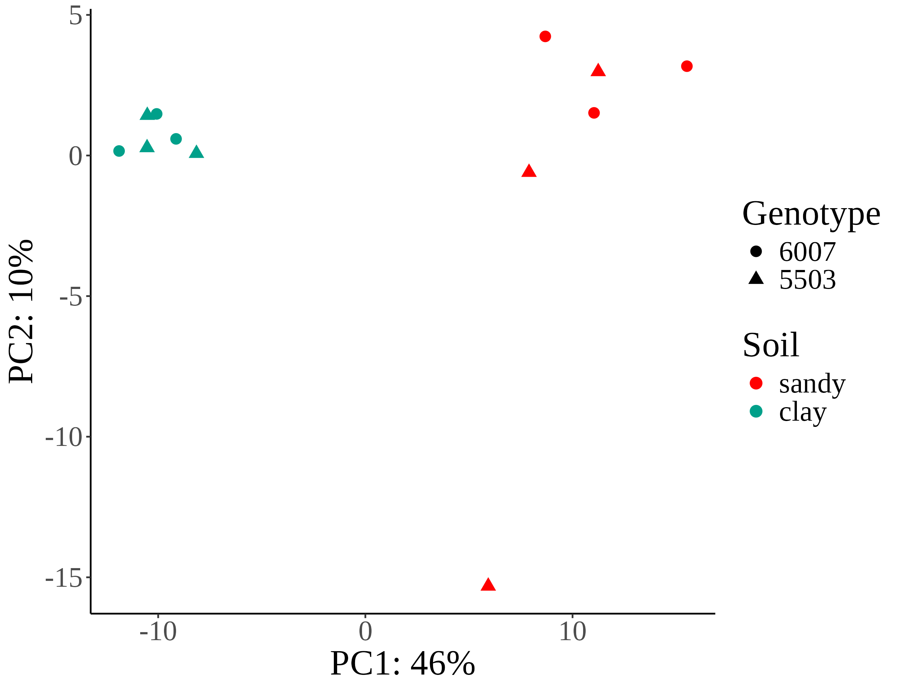
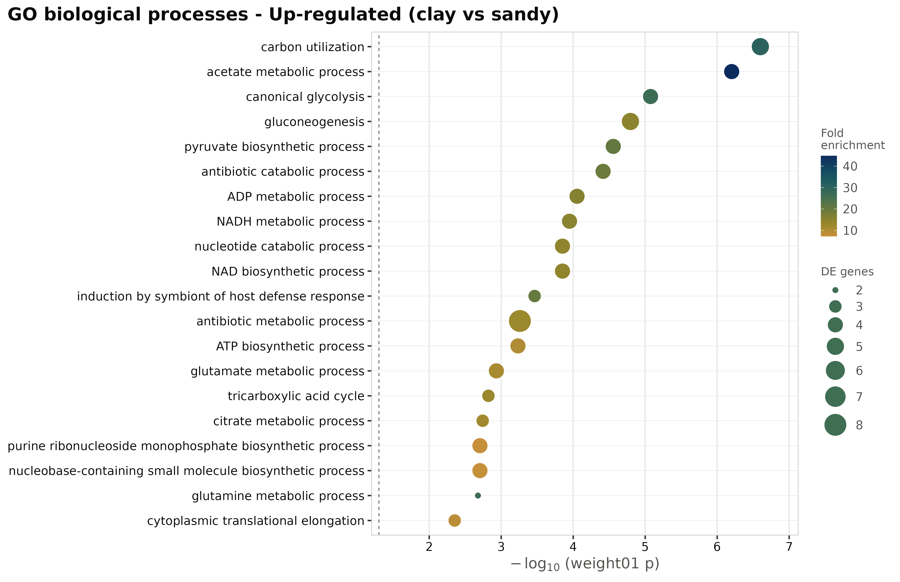
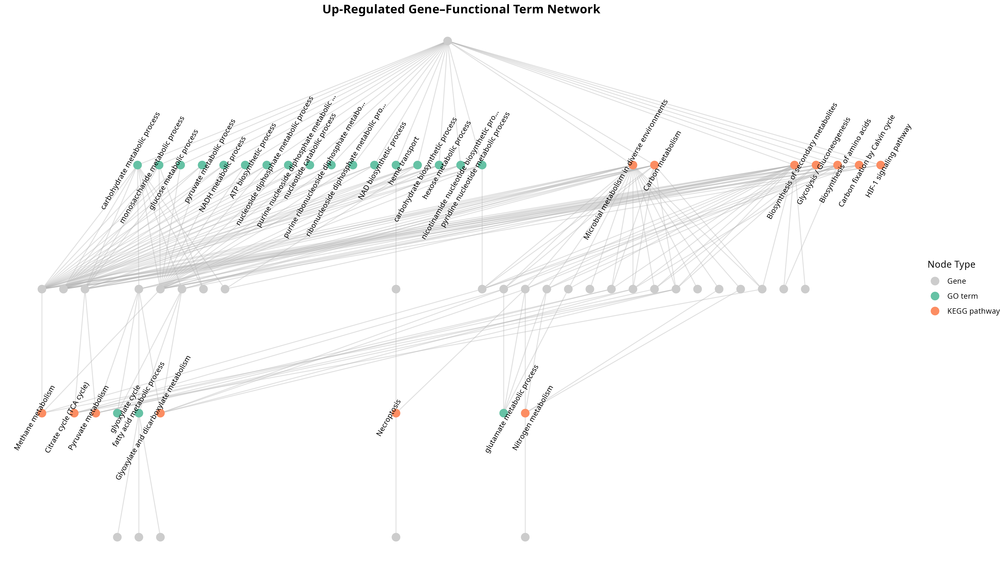
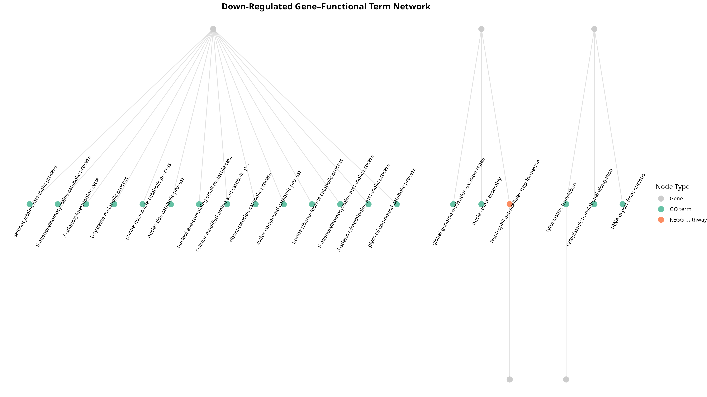

# bookish-waffle

# RNAseq analysis for smut pathogen (*Sporisorium scitamineum*) in sugarcane 

## Overview

ALL FILES IN /home/diegoj/bianca

---

## Repository Structure

```
.
├── raw_reads
├── README.md
├── references
├── rnaseq

```

## RNAseq Workflow Description

| sample                   | fastq_1                                                                                   | fastq_2                                                                                   | strandedness | status    | genotype | soil  | group        |
|--------------------------|--------------------------------------------------------------------------------------------|--------------------------------------------------------------------------------------------|--------------|-----------|----------|-------|--------------|
| 5503_clay_control_1      | /home/diegoj/bianca/raw_reads/NGS726_19_S19_L001_R1_001.fastq.gz                          | /home/diegoj/bianca/raw_reads/NGS726_19_S19_L001_R2_001.fastq.gz                          | auto         | control   | 5503     | clay  | NA           |
| 5503_clay_control_2      | /home/diegoj/bianca/raw_reads/NGS726_20_S20_L001_R1_001.fastq.gz                          | /home/diegoj/bianca/raw_reads/NGS726_20_S20_L001_R2_001.fastq.gz                          | auto         | control   | 5503     | clay  | NA           |
| 5503_clay_control_3      | /home/diegoj/bianca/raw_reads/NGS726_21_S21_L001_R1_001.fastq.gz                          | /home/diegoj/bianca/raw_reads/NGS726_21_S21_L001_R2_001.fastq.gz                          | auto         | control   | 5503     | clay  | NA           |
| 5503_clay_inoc_1         | /home/diegoj/bianca/raw_reads/NGS726_13_S13_L001_R1_001.fastq.gz                          | /home/diegoj/bianca/raw_reads/NGS726_13_S13_L001_R2_001.fastq.gz                          | auto         | infected  | 5503     | clay  | 5503_clay    |
| 5503_clay_inoc_2         | /home/diegoj/bianca/raw_reads/NGS726_14_S14_L001_R1_001.fastq.gz                          | /home/diegoj/bianca/raw_reads/NGS726_14_S14_L001_R2_001.fastq.gz                          | auto         | infected  | 5503     | clay  | 5503_clay    |
| 5503_clay_inoc_3         | /home/diegoj/bianca/raw_reads/NGS726_15_S15_L001_R1_001.fastq.gz                          | /home/diegoj/bianca/raw_reads/NGS726_15_S15_L001_R2_001.fastq.gz                          | auto         | infected  | 5503     | clay  | 5503_clay    |
| 5503_sandy_control_1     | /home/diegoj/bianca/raw_reads/NGS726_7_S7_L001_R1_001.fastq.gz                            | /home/diegoj/bianca/raw_reads/NGS726_7_S7_L001_R2_001.fastq.gz                            | auto         | control   | 5503     | sandy | NA           |
| 5503_sandy_control_2     | /home/diegoj/bianca/raw_reads/NGS726_8_S8_L001_R1_001.fastq.gz                            | /home/diegoj/bianca/raw_reads/NGS726_8_S8_L001_R2_001.fastq.gz                            | auto         | control   | 5503     | sandy | NA           |
| 5503_sandy_control_3     | /home/diegoj/bianca/raw_reads/NGS726_9_S9_L001_R1_001.fastq.gz                            | /home/diegoj/bianca/raw_reads/NGS726_9_S9_L001_R2_001.fastq.gz                            | auto         | control   | 5503     | sandy | NA           |
| 5503_sandy_inoc_1        | /home/diegoj/bianca/raw_reads/NGS726_1_S1_L001_R1_001.fastq.gz                            | /home/diegoj/bianca/raw_reads/NGS726_1_S1_L001_R2_001.fastq.gz                            | auto         | infected  | 5503     | sandy | 5503_sandy   |
| 5503_sandy_inoc_2        | /home/diegoj/bianca/raw_reads/NGS726_2_S2_L001_R1_001.fastq.gz                            | /home/diegoj/bianca/raw_reads/NGS726_2_S2_L001_R2_001.fastq.gz                            | auto         | infected  | 5503     | sandy | 5503_sandy   |
| 5503_sandy_inoc_3        | /home/diegoj/bianca/raw_reads/NGS726_3_S3_L001_R1_001.fastq.gz                            | /home/diegoj/bianca/raw_reads/NGS726_3_S3_L001_R2_001.fastq.gz                            | auto         | infected  | 5503     | sandy | 5503_sandy   |
| 6007_clay_control_1      | /home/diegoj/bianca/raw_reads/NGS726_22_S22_L001_R1_001.fastq.gz                          | /home/diegoj/bianca/raw_reads/NGS726_22_S22_L001_R2_001.fastq.gz                          | auto         | control   | 6007     | clay  | NA           |
| 6007_clay_control_2      | /home/diegoj/bianca/raw_reads/NGS726_23_S23_L001_R1_001.fastq.gz                          | /home/diegoj/bianca/raw_reads/NGS726_23_S23_L001_R2_001.fastq.gz                          | auto         | control   | 6007     | clay  | NA           |
| 6007_clay_control_3      | /home/diegoj/bianca/raw_reads/NGS726_24_S24_L001_R1_001.fastq.gz                          | /home/diegoj/bianca/raw_reads/NGS726_24_S24_L001_R2_001.fastq.gz                          | auto         | control   | 6007     | clay  | NA           |
| 6007_clay_inoc_1         | /home/diegoj/bianca/raw_reads/NGS726_16_S16_L001_R1_001.fastq.gz                          | /home/diegoj/bianca/raw_reads/NGS726_16_S16_L001_R2_001.fastq.gz                          | auto         | infected  | 6007     | clay  | 6007_clay    |
| 6007_clay_inoc_2         | /home/diegoj/bianca/raw_reads/NGS726_17_S17_L001_R1_001.fastq.gz                          | /home/diegoj/bianca/raw_reads/NGS726_17_S17_L001_R2_001.fastq.gz                          | auto         | infected  | 6007     | clay  | 6007_clay    |
| 6007_clay_inoc_3         | /home/diegoj/bianca/raw_reads/NGS726_18_S18_L001_R1_001.fastq.gz                          | /home/diegoj/bianca/raw_reads/NGS726_18_S18_L001_R2_001.fastq.gz                          | auto         | infected  | 6007     | clay  | 6007_clay    |
| 6007_sandy_control_1     | /home/diegoj/bianca/raw_reads/NGS726_10_S10_L001_R1_001.fastq.gz                          | /home/diegoj/bianca/raw_reads/NGS726_10_S10_L001_R2_001.fastq.gz                          | auto         | control   | 6007     | sandy | NA           |
| 6007_sandy_control_2     | /home/diegoj/bianca/raw_reads/NGS726_11_S11_L001_R1_001.fastq.gz                          | /home/diegoj/bianca/raw_reads/NGS726_11_S11_L001_R2_001.fastq.gz                          | auto         | control   | 6007     | sandy | NA           |
| 6007_sandy_control_3     | /home/diegoj/bianca/raw_reads/NGS726_12_S12_L001_R1_001.fastq.gz                          | /home/diegoj/bianca/raw_reads/NGS726_12_S12_L001_R2_001.fastq.gz                          | auto         | control   | 6007     | sandy | NA           |
| 6007_sandy_inoc_1        | /home/diegoj/bianca/raw_reads/NGS726_4_S4_L001_R1_001.fastq.gz                            | /home/diegoj/bianca/raw_reads/NGS726_4_S4_L001_R2_001.fastq.gz                            | auto         | infected  | 6007     | sandy | 6007_sandy   |
| 6007_sandy_inoc_2        | /home/diegoj/bianca/raw_reads/NGS726_5_S5_L001_R1_001.fastq.gz                            | /home/diegoj/bianca/raw_reads/NGS726_5_S5_L001_R2_001.fastq.gz                            | auto         | infected  | 6007     | sandy | 6007_sandy   |
| 6007_sandy_inoc_3        | /home/diegoj/bianca/raw_reads/NGS726_6_S6_L001_R1_001.fastq.gz                            | /home/diegoj/bianca/raw_reads/NGS726_6_S6_L001_R2_001.fastq.gz                            | auto         | infected  | 6007     | sandy | 6007_sandy   |


### 1. **References**

- `Genome Assembly`: /home/diegoj/bianca/references/PEDRO_genome/fix_pedro.fasta 
- `Proteins`: /home/diegoj/bianca/references/PEDRO_genome/proteins_clean.fasta
- `GTF`: /home/diegoj/bianca/references/PEDRO_genome/SSC04-MAT1.gtf

### 2. **Protein Annotation**

We used `emapper-2.1.3` from `EggNOG v5.0` to get KEGG orthology and GO  annotations for the proteins of the genome based on orthology relationships. 
- Results: `/home/diegoj/bianca/references/PEDRO_genome/annotation/eggnog.emapper.annotations`

### 3. **RNAseq processing**

We used a `Nextflow v25.04.7` pipeline `rnaseq (v3.12.0)` from nf-core (https://nf-co.re/rnaseq/3.12.0) to preprocces, align and quantify RNAseq data

We used the default method from `rnaseq (v3.12.0)` which uses `STAR` aligner and `Salmon` to quantify transcript abundance.

See full software versions in 

[Sofware versions (txt)](rnaseq/full_run1_no_collapse/pipeline_info/nf_core_rnaseq_software_mqc_versions.yml)


Full report of preprocess and aligment can be found in 
[Download full report (zip)]( rnaseq/collapsed_full_run/multiqc/star_salmon/multiqc_report.zip)*(right-click and save as to view)*


### 4. **Exploratory Analysis**

- Principal component analysis: We load the quantification data produced by Salmon into DESEQ2 (Love et al., 2014) and used the transformed counts matrix variance stabilizing transformation (vst) which accounts for the dependance between abundance and variance in RNAseq data.




### 5. **Differential Expression Analysis (DEA)**

We conducted a differential expression analysis (DEA) using DESEeq2 R package between several contrasts: 5503 clay vs 5503 sandy (4, 5, 6 vs 10, 11, 12), 6007 clay vs 6007 sandy (16, 17, 18 vs 22, 23, 24),  5503 clay vs 6007 clay (4, 5, 6 vs 16, 17, 18), 5503 sandy vs 6007 sandy (10, 11, 12 vs 22, 23, 24). We filtered out low expressed genes with less than 1 count in at least 7/12 samples (or 4/6 depending o the tested contrasts).

We used `lfcThreshold = 1` and `altHypothesis = "greaterAbs"` to identify transcripts that were differentially expressed at least twofold above or below the background expression level. We refer to upregulated genes as those more highly expressed in clay than in sand, downregulated genes as those more highly expressed in the sand than in the clay soil. We corrected multiple testing using FDR (false discovery rate);

| Contrast              | Total | Upregulated | Downregulated |
|-----------------------|-------|-------------|---------------|
| 5503_clay_vs_sandy    | 1     | 0           | 1             |
| 6007_clay_vs_sandy    | 1     | 1           | 0             |
| 5503_vs_6007_clay     | 0     | 0           | 0             |
| 5503_vs_6007_sandy    | 0     | 0           | 0             |
| overall_clay_vs_sandy | 88    | 83          | 5             |
| overall_5503_vs_6007  | 0     | 0           | 0             |


- code: /home/diegoj/bianca/rnaseq/full_run1_no_collapse/star_salmon/deseq2_qc/dea_claude_dev.r

    For overrall clay vs sand the complete results are located at 
- results: /home/diegoj/bianca/rnaseq/full_run1_no_collapse/star_salmon/deseq2_qc/overall_clay_vs_sandy/

### 6. **Functional Enrichment Analysis**

To get insights about the function and the processes that are represented by the sets of up-regulated and down-regulated genes we carried out over representation analysis (ORA) for gene ontology terms (GO) and KEGG pathways.

#### GO enrichment — topGO `weight01`

We used the topGO R package (v2.58.0) restricted to the **Biological Process** ontology. The gene universe is the **3,024 genes carrying at least one BP annotation** in the reference annotation, and terms with fewer than five annotated genes were excluded (`nodeSize = 5`), leaving **2,633 testable terms**.

**The method reported here is `weight01`, not `classic`.** `weight01` is topology-aware: it traverses the GO graph from the most specific terms upward and scores each term *conditional on its descendants*, so a broad parent term whose signal is already explained by a more specific child is down-weighted. This removes the redundant ancestor/descendant blocks that a term-by-term test produces (102 of the 137 terms nominally significant under `classic` fall to p = 1 under `weight01`).

**`weight01` p-values are reported uncorrected, and this is deliberate.** The algorithm conditions each test on the graph structure and therefore already accounts for the dependency between terms; applying a further FDR correction on top of it is not recommended by the method's authors and would be doubly conservative. We use raw `weight01` p < 0.05 as the significance criterion.

| gene set | terms at `weight01` p < 0.05 | interpretation |
|---|---|---|
| up-regulated in clay (83 genes) | **28** | significant; central carbon metabolism |
| down-regulated in clay (5 genes) | 19 | **not significant** — see caveat below |

**Up-regulated (main result)** — the 20 most significant of the 28 terms. Point area = number of up-regulated genes annotated to the term (2–8); fill colour = fold enrichment over the count expected by chance (7.3–44.8×); dashed line = p = 0.05.



[Up-regulated, weight01 (PDF)](rnaseq/full_run1_no_collapse/star_salmon/deseq2_qc/overall_clay_vs_sandy/topgo_corrected/GO_up_weight01.pdf)

**Down-regulated — no term is statistically significant.** No GO term survives FDR correction in this gene set (0 of 2,633). The down-regulated set contains only 5 genes, 4 of which carry a GO annotation, and **every term in the panel below is supported by a single gene**, so the apparent 21.6–151.2× fold enrichments are an artefact of very small counts and must not be read as biological enrichment. Shown for completeness only.

[Down-regulated, weight01 — exploratory, not significant (PDF)](rnaseq/full_run1_no_collapse/star_salmon/deseq2_qc/overall_clay_vs_sandy/topgo_corrected/GO_down_weight01.pdf)

**Supporting, non-topology view.** For reference we also ran the `classic` algorithm (each term scored independently of the GO graph) with Benjamini–Hochberg correction across all 2,633 tested terms; 67 terms pass FDR < 0.05. Because `classic` ignores the graph, ancestor and descendant terms sharing the same genes appear as separate entries — the three leading acid-metabolism terms rest on the same 19 genes, and six glycolysis-related terms on the same 4. This is exactly the redundancy `weight01` resolves, which is why `weight01` is the reported method.

[Up-regulated, classic + BH (PDF)](rnaseq/full_run1_no_collapse/star_salmon/deseq2_qc/overall_clay_vs_sandy/topgo_corrected/GO_up_classic_BH.pdf) · [Down-regulated, classic raw p — not significant (PDF)](rnaseq/full_run1_no_collapse/star_salmon/deseq2_qc/overall_clay_vs_sandy/topgo_corrected/GO_down_classic_rawp_NOT_significant.pdf)

> **Correction note.** These results supersede an earlier run of `topGO.r`. That script compared p-values as formatted text, which silently discarded every term with p below ~1e-4 (the 31 most significant up-regulated terms, best true p = 4.1e-09, never reached the output), and applied BH correction to the already-significant subset, which makes the correction vacuous. The superseded `GO_up.*` / `GO_down.*` files are kept in `overall_clay_vs_sandy/` for comparison. Full description, evidence and figure legends: [README_fix_topgo.md](rnaseq/full_run1_no_collapse/star_salmon/deseq2_qc/README_fix_topgo.md). Script: [`topGO_fixed.r`](rnaseq/full_run1_no_collapse/star_salmon/deseq2_qc/topGO_fixed.r).

Figures use the perceptually uniform, colour-vision-deficiency safe scientific colour map *batlow* (Crameri 2018).

- Alexa A, Rahnenführer J, Lengauer T (2006) Improved scoring of functional groups from gene expression data by decorrelating GO graph structure. *Bioinformatics* 22:1600–1607.
- Crameri F (2018) Scientific colour maps. Zenodo, doi:10.5281/zenodo.1243862.

#### KEGG

We used the enrichKEGG function from Cluster profiler R package (v4.14.6) to get KEGG enriched categories in each gene set (up regulated and down regulated)

[Overrepresented KEGGs in differentially expressed genes (PDF)](rnaseq/full_run1_no_collapse/star_salmon/deseq2_qc/overall_clay_vs_sandy/keggs_plots.pdf)


### 7. **Putative effector annotation**

We used Phobius v1.01 (https://phobius.sbc.su.se/) to signal peptides and transmembrane domais, the proteins with at least one signal peptide and with no transmembrando domains where classified as putative effectors.

/home/diegoj/bianca/references/PEDRO_genome/annotation


### 8. **GO-KEGG Interaction Network**

To get some insights about the function of down regulated and up regulated genes we built two networks, one for up and another for down regulated genes, where the nodes can be represented by genes, GO or KEGG. The edges represent the GO term and/or the KEGG pathways related to that gene. In this way we can explore the functions and the procesess in which the down and up regulated genes are involved.

- Up: 

- Down: 


Full results in: 

/home/diegoj/bianca/rnaseq/full_run1_no_collapse/star_salmon/deseq2_qc/overall_clay_vs_sandy

### 9. **Important Files**

| **Process Step** | **Description** | **File Path** |
|------------------|-----------------|----------------|
| **Quality Control** | MultiQC report | `rnaseq/full_run1_no_collapse/multiqc/star_salmon/multiqc_report.html` |
| **Quantification (Salmon)** | TPM counts | `rnaseq/full_run1_no_collapse//star_salmon/salmon.merged.gene_counts.tsv` |
| | RAW counts | `rnaseq/full_run1_no_collapse/star_salmon/salmon.merged.transcript_counts.tsv` |
| **Differential Expression (DESeq2)** | Up-regulated genes | `rnaseq/full_run1_no_collapse/star_salmon/deseq2_qc/overall_clay_vs_sandy/DEGs_upregulated_overall_clay_vs_sandy.csv` |
| | Down-regulated genes | `rnaseq/full_run1_no_collapse/star_salmon/deseq2_qc/overall_clay_vs_sandy/DEGs_upregulated_overall_clay_vs_sandy.csv` |
| | Main dir analysis | `rnaseq/full_run1_no_collapse/star_salmon/deseq2_qc/` |
| **Functional Enrichment (GO, topGO `weight01`)** | GO up — significant terms (28) | `rnaseq/full_run1_no_collapse/star_salmon/deseq2_qc/overall_clay_vs_sandy/topgo_corrected/GO_up_weight01_p0.05.csv` |
| | GO down — 19 terms, none significant | `rnaseq/full_run1_no_collapse/star_salmon/deseq2_qc/overall_clay_vs_sandy/topgo_corrected/GO_down_weight01_p0.05.csv` |
| | All 2,633 tested terms (counts, fold enrichment, classic p, BH, weight01 p) | `rnaseq/.../overall_clay_vs_sandy/topgo_corrected/GO_{up,down}_all_tested_terms.csv` |
| | Supporting: classic + BH, FDR < 0.05 (67 up, 0 down) | `rnaseq/.../overall_clay_vs_sandy/topgo_corrected/GO_{up,down}_FDR0.05.csv` |
| | Enrichment script | `rnaseq/full_run1_no_collapse/star_salmon/deseq2_qc/topGO_fixed.r` |
| | *Superseded* GO results (kept for comparison) | `rnaseq/full_run1_no_collapse/star_salmon/deseq2_qc/overall_clay_vs_sandy/GO_{up,down}.csv` |
| | GO–KEGG interaction network (up-regulated) | `rnaseq/full_run1_no_collapse/star_salmon/deseq2_qc/overall_clay_vs_sandy/gene_network_up_edges.tsv` |
| | GO–KEGG interaction network (down-regulated) | `rnaseq/full_run1_no_collapse/star_salmon/deseq2_qc/overall_clay_vs_sandy/gene_network_down_edges.tsv` |
| **Functional Annotation** | EggNOG results | `references/PEDRO_genome/annotation/eggnog.emapper.annotations` |
| gene_go_table.txt | formatted GO terms | `references/PEDRO_genome/annotation/gene_go_table.txt` |
| putative_effectors.ids | Putative effectors | `references/PEDRO_genome/annotation/putative_effectors.ids` |


